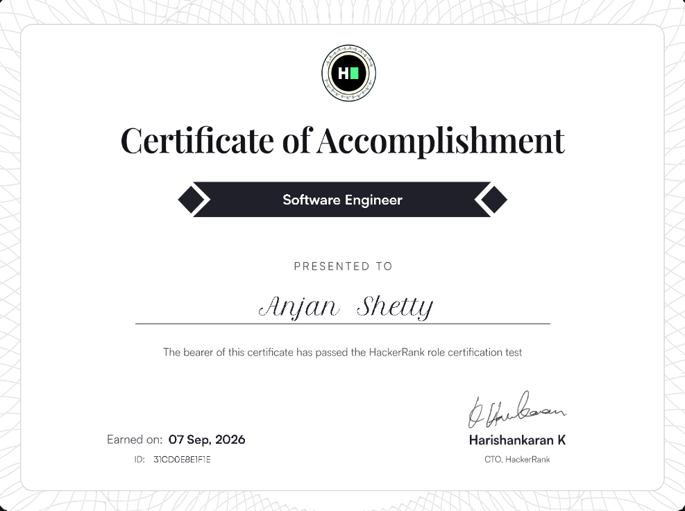
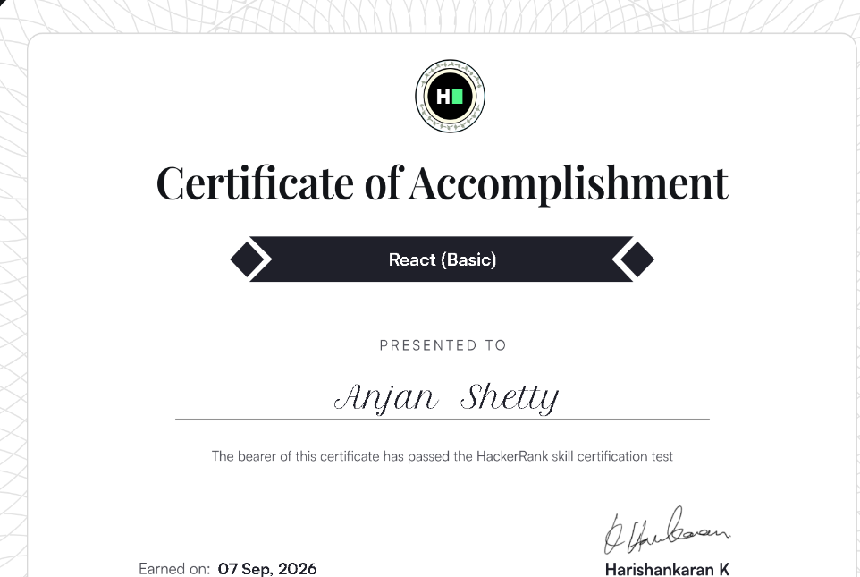
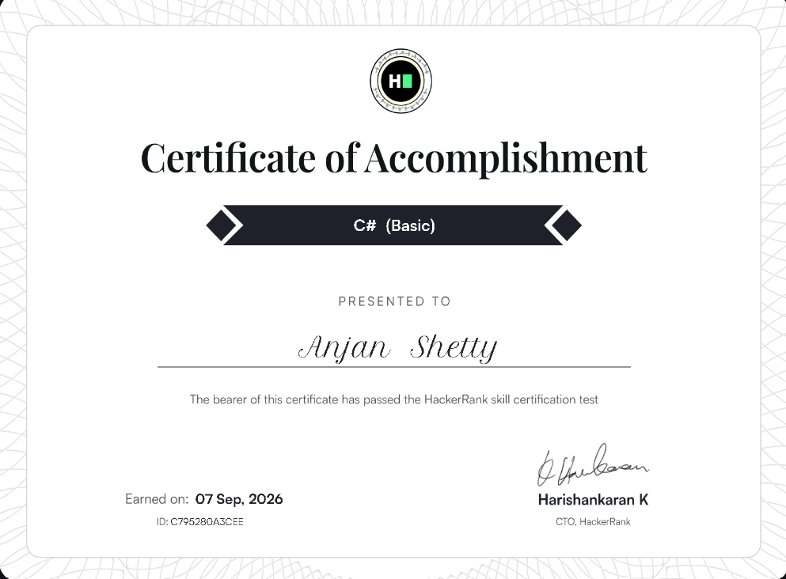
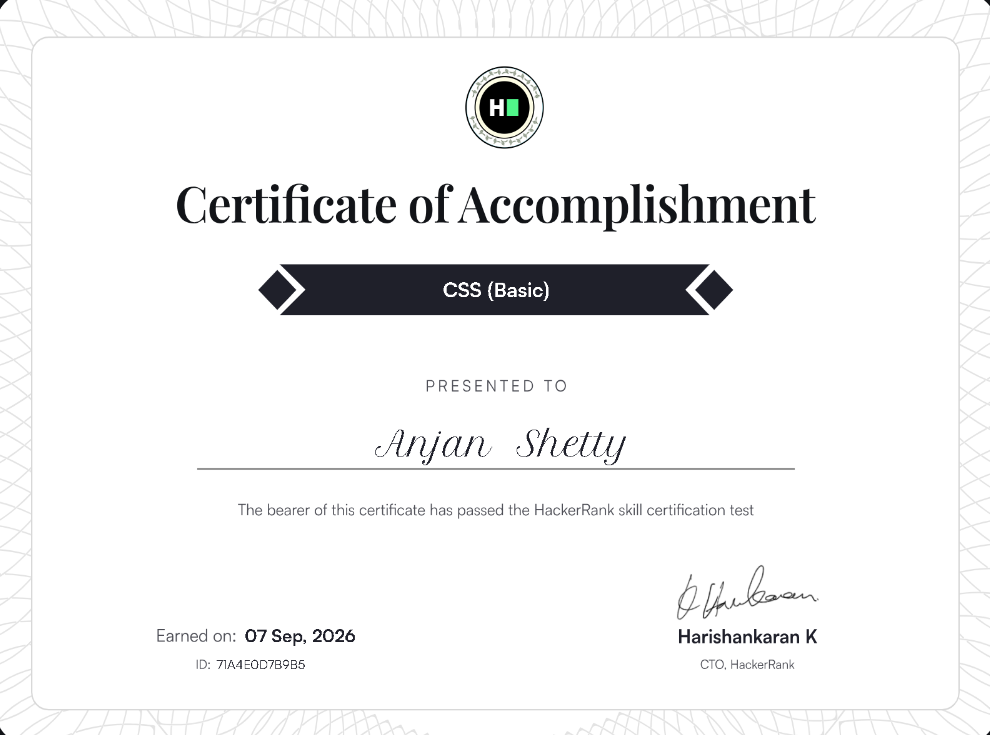
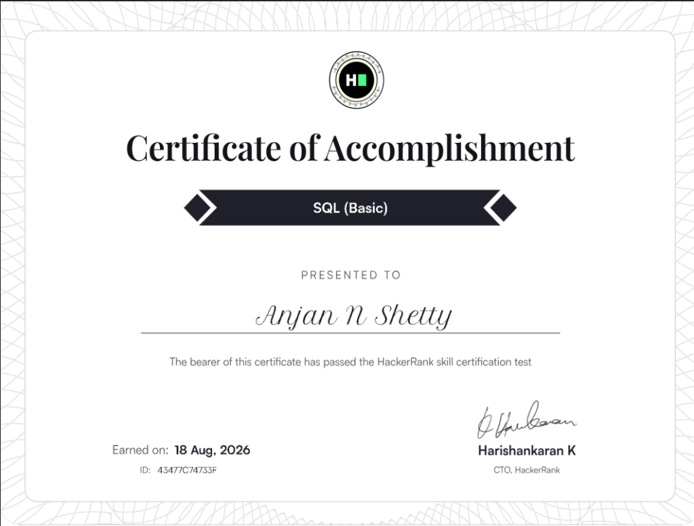
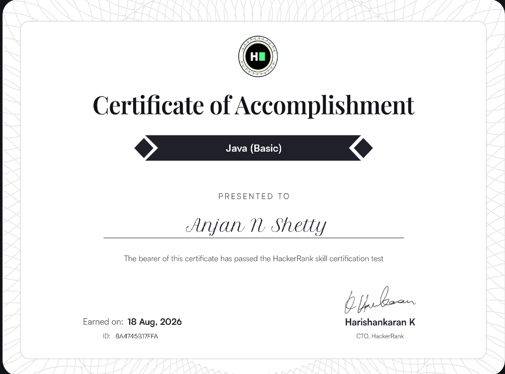

<div align="center">

#  ANJAN SHETTY

> *"The night is darkest before the code compiles."*<br>
> **Building from the shadows. Shipping into the light.**

<br>


<br><br>

<!-- GOTHAM BADGES -->
<p align="center">
  
  
  
  
</p>

</div>

<!-- GOTHAM VISITOR COUNTER & SECURE AUDIO TELEMETRY -->
<p align="center">
  
</p>

<p align="center">
  
</p>

##  THE BAT-SIGNAL

> *"When that light hits the sky, it's not just a call. It's a warning."*

I am **Anjan Shetty**, an engineering student and developer focused on turning conceptual problems into resilient, working software. My journey centers around building developer tools, engineering scalable backend architectures, exploring intelligent systems, and learning practical system design.

Whether architecting full-stack web applications or automating complex developer workflows, my philosophy is grounded in understanding fundamentals, writing clean code, and shipping into the real world.

<div align="center">
  
</div>

##  ABOUT ME // OPERATIVE DOSSIER

> *"Somewhere between an idea and a working product, there is a lot of debugging."*

<table border="0" width="100%">
<tr>
<td width="50%" align="center" valign="middle">


</td>
<td width="50%" valign="top">

```yaml
Wayne Enterprises Security Clearance:
  Operative: Anjan Shetty
  Codename: codexanjan
  Clearance: Level 10 // Omega
  Division: Applied Sciences & Architecture

Role:
  - Engineering Student
  - Full Stack Developer
  - AI/ML Solutions Architect

Currently Learning:
  - MERN Stack Architecture
  - Agentic AI & LLM Pipelines
  - Cloud Infrastructure & DevOps

Interests & Focus:
  - Scalable Web Applications
  - Open Source Engineering
  - High-Fidelity UI/UX Systems
  - Applied AI/ML Research

Operative Creed:
  "Building in the dark. Shipping into the light."
```

</td>
</tr>
</table>

##  TACTICAL PROFILE // DEVELOPER LEVEL

Real-time operative progression, algorithmic telemetry, and problem-solving readiness:

<div align="center">

<table border="0" width="100%">
  <tr align="center">
    <td width="50%" align="center" valign="middle">
      
    </td>
    <td width="50%" align="center" valign="middle">
      
    </td>
  </tr>
</table>

</div>

##  TECH ARSENAL // BATCAVE ARMORY

A curated inventory of the languages, frameworks, and tools deployed across missions:

### Languages
<p>
  
  
  
  
  
  
  
</p>

### Frameworks & Libraries
<p>
  
  
  
  
  
  
</p>

### Backend & APIs
<p>
  
  
  
  
</p>

### Databases, Cloud & DevOps
<p>
  
  
  
  
  
  
</p>

### Tools & Operations
<p>
  
  

  
  
</p>

##  PROJECT DATABASE // GOTHAM ARCHIVES

<table border="0" width="100%">
<tr>
<td width="50%" valign="top">

### 🔗 [URLForge](https://github.com/codexanjan/urlforge) // Link Forge & Analytics Engine
High-performance URL shortener and link redirection architecture engineered for rapid dispatch, telemetry analytics, and clean RESTful design.

- **Focus**: Fast URL resolution, link analytics & clean API architecture
- **Stack**: `TypeScript` • `Node.js` • `Express` • `RESTful API`
- **Repository**: [codexanjan/urlforge](https://github.com/codexanjan/urlforge)

</td>
<td width="50%" valign="top">

### ⚛️ [PeriodicPortal](https://github.com/codexanjan/periodictable) // 3D Interactive Chemistry Hub
A modern educational web platform exploring all 118 chemical elements with glowing cards, 3D Bohr orbital models, trend analytics, and a built-in Chemistry AI chatbot.

- **Focus**: 3D orbital visualization, chemical data & conversational AI
- **Stack**: `TypeScript` • `React` • `Three.js` • `AI Integration`
- **Repository**: [codexanjan/periodictable](https://github.com/codexanjan/periodictable)

</td>
</tr>
<tr>
<td width="50%" valign="top">

### 📝 [Markdown Studio](https://github.com/codexanjan/markdown-editor) // Live Browser Editor
Sleek browser-based Markdown studio offering real-time live preview, intelligent syntax highlighting, multi-format export tools, and productivity templates.

- **Focus**: Real-time parser rendering, AST manipulation & responsive UX
- **Stack**: `TypeScript` • `React` • `Markdown Engine` • `CSS Modules`
- **Repository**: [codexanjan/markdown-editor](https://github.com/codexanjan/markdown-editor)

</td>
<td width="50%" valign="top">

### 📅 [Smart Calendar](https://github.com/codexanjan/smart-calender) // Productivity & Schedule Hub
Customizable personal scheduling platform built for calendar optimization, event management, and fluid user experience.

- **Focus**: State orchestration, responsive calendar view & UX architecture
- **Stack**: `TypeScript` • `React` • `Tailwind CSS` • `Vite`
- **Repository**: [codexanjan/smart-calender](https://github.com/codexanjan/smart-calender)

</td>
</tr>
</table>

<p align="center">
  <a href="https://github.com/codexanjan?tab=repositories" target="_blank">
    
  </a>
</p>

##  CERTIFICATION VAULT

> *"Credentials forged in discipline. Knowledge deployed in the shadows."*

<div align="center">

<table border="0" width="100%">
<tr>

<td width="33.33%" align="center" valign="top">

<!-- Certificate 1: Software Engineer -->
<a href="https://www.hackerrank.com/certificates/31cd0e8e1f1e" target="_blank">
  
</a>

<br><br>

<a href="https://www.hackerrank.com/certificates/31cd0e8e1f1e" target="_blank">
  
</a>

</td>

<td width="33.33%" align="center" valign="top">

<!-- Certificate 2: React Basic -->
<a href="https://www.hackerrank.com/profile/anjanshetty" target="_blank">
  
</a>

<br><br>

<a href="https://www.hackerrank.com/profile/anjanshetty" target="_blank">
  
</a>

</td>

<td width="33.33%" align="center" valign="top">

<!-- Certificate 3: C# Basic -->
<a href="https://www.hackerrank.com/certificates/c795280a3cee" target="_blank">
  
</a>

<br><br>

<a href="https://www.hackerrank.com/certificates/c795280a3cee" target="_blank">
  
</a>

</td>

</tr>
<tr>

<td width="33.33%" align="center" valign="top">

<!-- Certificate 4: CSS Basic -->
<a href="https://www.hackerrank.com/certificates/71a4e0d7b9b5" target="_blank">
  
</a>

<br><br>

<a href="https://www.hackerrank.com/certificates/71a4e0d7b9b5" target="_blank">
  
</a>

</td>

<td width="33.33%" align="center" valign="top">

<!-- Certificate 5: SQL Basic -->
<a href="https://www.hackerrank.com/certificates/43477c74733f" target="_blank">
  
</a>

<br><br>

<a href="https://www.hackerrank.com/certificates/43477c74733f" target="_blank">
  
</a>

</td>

<td width="33.33%" align="center" valign="top">

<!-- Certificate 6: Java Basic -->
<a href="https://www.hackerrank.com/certificates/8a4745b17ffa" target="_blank">
  
</a>

<br><br>

<a href="https://www.hackerrank.com/certificates/8a4745b17ffa" target="_blank">
  
</a>

</td>

</tr>
</table>

</div>

##  GOTHAM TELEMETRY // MAINFRAME METRICS

Telemetry and code activity monitored through GitHub's analytical services:

<div align="center">


<br><br>

<table border="0" width="100%">
  <tr align="center">
    <td width="50%" align="center" valign="middle">
      <a href="https://github.com/codexanjan">
        
      </a>
    </td>
    <td width="50%" align="center" valign="middle">
      <a href="https://github.com/codexanjan">
        
      </a>
    </td>
  </tr>
  <tr align="center">
    <td width="50%" align="center" valign="middle">
      <a href="https://github.com/codexanjan">
        
      </a>
    </td>
    <td width="50%" align="center" valign="middle">
      <a href="https://github.com/codexanjan">
        
      </a>
    </td>
  </tr>
</table>

<br>


<br/>
<sub><code>⚡ ACTIVE BATCAVE RUNTIMES & LANGUAGES</code></sub>

</div>

##  COMMIT RADAR // CODE CADENCE

<div align="center">

<!-- Gotham Activity Line Graph -->
<a href="https://github.com/codexanjan">
  
</a>

<br><br>

</div>

##  CONTRIBUTION PATROL // VIGILANTE CADENCE

<div align="center">


</div>

##  2026 MISSION DIRECTIVES // ROADMAP

Operative milestones scheduled across the 2026 tactical deployment roadmap:

- [x] 🦇 **Initialize Batcave Telemetry HUD**: Deploy interactive mainframe profile & real-time analytics.
- [ ] 🧠 **2,000+ Algorithmic Directives**: Solve 2,000+ DSA problems across LeetCode, CodeWars, and GeeksforGeeks.
- [ ] 🏆 **5 Elite Hackathons**: Compete and architect high-impact solutions in national & global hackathons.
- [ ] 🚀 **10 Production-Grade Systems**: Ship 10 resilient, scalable full-stack applications with CI/CD.
- [ ] 📈 **1,000 Sustained Contributions**: Maintain consistent open-source engineering cadence and commits.
- [ ] 🤖 **Deploy End-to-End AI SaaS**: Architect and launch a multi-tenant applied AI product solving real problems.

##  TROPHY ROOM // GOTHAM ACCOLADES

<div align="center">

<a href="https://github.com/codexanjan">
  
</a>

</div>

##  THE DARK KNIGHT'S CODE // CORE PROTOCOL

> **"It's not who I am underneath, but what I do that defines me."**

##  BATCAVE COMMS // SECURE CHANNELS

Connect across developer networks and platforms:

<div align="center">

<a href="https://github.com/codexanjan" target="_blank">
  
</a>
<a href="https://twitter.com/anjxnshetty" target="_blank">
  
</a>
<a href="https://discord.com/users/codexanjan" target="_blank">
  
</a>
<a href="https://gitlab.com/codexanjan" target="_blank">
  
</a>
<a href="https://leetcode.com/u/anjanshetty" target="_blank">
  
</a>
<a href="https://www.codewars.com/users/codexanjan" target="_blank">
  
</a>
<a href="https://www.geeksforgeeks.org/profile/anjanshetty" target="_blank">
  
</a>
<a href="https://tryhackme.com/p/anjanshetty" target="_blank">
  
</a>
<a href="https://dev.to/anjanshetty" target="_blank">
  
</a>
<a href="https://stackoverflow.com/users/anjanshetty" target="_blank">
  
</a>
<a href="https://reddit.com/u/anjxnshetty" target="_blank">
  
</a>

<br><br>

<p>If you find value in my open-source work or want to support my technical journey:</p>

<a href="https://buymeacoffee.com/anjxnshetty" target="_blank">
  
</a>

</div>

##  BATCAVE TERMINAL // COMMAND SHELL

```bash
┌──(batcave㉿gotham)-[~]
└─$ whoami
anjan shetty // codexanjan

┌──(batcave㉿gotham)-[~]
└─$ mission
build useful software. ship into the light.

┌──(batcave㉿gotham)-[~]
└─$ status

Still building.
Still learning.
Still in the shadows.

┌──(batcave㉿gotham)-[~]
└─$ exit
See you in Gotham. 🦇
```

<br>

<div align="center">

  

<br><br>

<p align="center">
  
</p>

</div>
