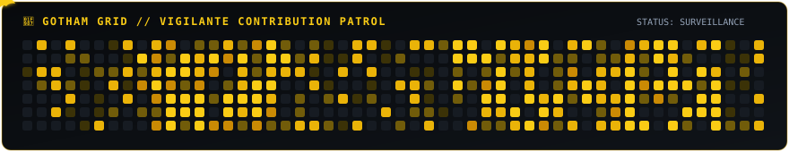

<div align="center">

#  ANJAN SHETTY

> *"The night is darkest before the code compiles."*<br>
> **Building from the shadows. Shipping into the light.**

<br>


<br><br>

<!-- GOTHAM BADGES -->
<p align="center">
  
  
  
  
  
</p>

<br>

<!-- SWINGING BATMAN ID LANYARD -->
<div align="center">
  
</div>

</div>

##  The Bat-Signal

> *"When that light hits the sky, it's not just a call. It's a warning."*

I am **Anjan Shetty**, an engineering student and developer focused on turning conceptual problems into resilient, working software. My journey centers around building developer tools, engineering scalable backend architectures, exploring intelligent systems, and learning practical system design.

Whether architecting full-stack web applications or automating complex developer workflows, my philosophy is grounded in understanding fundamentals, writing clean code, and shipping into the real world.

<div align="center">
  
</div>

##  About Me

> *"Somewhere between an idea and a working product, there is a lot of debugging."*

<div align="center">
  
</div>

```yaml
Role:
  - Student
  - Full Stack Developer
  - AI/ML Enthusiast

Currently Learning:
  - MERN Stack
  - AI Integrations
  - Cloud & DevOps

Interests:
  - Web Development
  - Open Source
  - UI/UX Designing
  - AI/ML Research
```

##  Current Mission

<table border="0" width="100%">
<tr>
<td width="60%" valign="top">

Current investigative objectives:
- **Full-Stack Development**: Engineering robust web architectures with React, Next.js, and modern TypeScript.
- **Backend Engineering**: Designing scalable microservices, REST APIs, and event-driven data pipelines.
- **AI-Powered Applications**: Integrating LLM capabilities, agentic workflows, and semantic retrieval systems.
- **Developer Tooling**: Building lightweight CLI utilities that streamline developer productivity.
- **System Design & Cloud**: Exploring distributed systems, container orchestration, and automated CI/CD pipelines.

</td>
<td width="40%" align="center" valign="middle">


</td>
</tr>
</table>

##  Currently Building

<table border="0" width="100%">
<tr>
<td width="25%" align="center" valign="top">

### SYSTEMS
**Scalable Backend**<br>
Microservices, high-throughput REST APIs & clean architecture

</td>
<td width="25%" align="center" valign="top">

### AI
**Intelligent Agents**<br>
AI engineering, dynamic tool calling & reasoning pipelines

</td>
<td width="25%" align="center" valign="top">

### CLOUD
**Infrastructure**<br>
Containerization, Docker, Linux & automated CI/CD deployment

</td>
<td width="25%" align="center" valign="top">

### OPEN SOURCE
**Vigilante Dev**<br>
Community utilities, documentation & shipping real tools

</td>
</tr>
</table>

<br>

<div align="center">
  
</div>

##  Batcave Arsenal

A curated inventory of the languages, frameworks, and tools deployed across missions:

### Languages
<p>
  
  
  
  
  
  
  
</p>

### Frameworks & Libraries
<p>
  
  
  
  
  
  
</p>

### Backend & APIs
<p>
  
  
  
  
</p>

### Databases, Cloud & DevOps
<p>
  
  
  
  
  
  
</p>

### Tools & Operations
<p>
  
  
  
  
  
</p>

##  Batcomputer // Project Database

<table border="0" width="100%">
<tr>
<td width="50%" valign="top">

### 🔗 [URLForge](https://github.com/codexanjan/urlforge) // Link Forge & Analytics Engine
High-performance URL shortener and link redirection architecture engineered for rapid dispatch, telemetry analytics, and clean RESTful design.

- **Focus**: Fast URL resolution, link analytics & clean API architecture
- **Stack**: `TypeScript` • `Node.js` • `Express` • `RESTful API`
- **Repository**: [codexanjan/urlforge](https://github.com/codexanjan/urlforge)

</td>
<td width="50%" valign="top">

### ⚛️ [PeriodicPortal](https://github.com/codexanjan/periodictable) // 3D Interactive Chemistry Hub
A modern educational web platform exploring all 118 chemical elements with glowing cards, 3D Bohr orbital models, trend analytics, and a built-in Chemistry AI chatbot.

- **Focus**: 3D orbital visualization, chemical data & conversational AI
- **Stack**: `TypeScript` • `React` • `Three.js` • `AI Integration`
- **Repository**: [codexanjan/periodictable](https://github.com/codexanjan/periodictable)

</td>
</tr>
<tr>
<td width="50%" valign="top">

### 📝 [Markdown Studio](https://github.com/codexanjan/markdown-editor) // Live Browser Editor
Sleek browser-based Markdown studio offering real-time live preview, intelligent syntax highlighting, multi-format export tools, and productivity templates.

- **Focus**: Real-time parser rendering, AST manipulation & responsive UX
- **Stack**: `TypeScript` • `React` • `Markdown Engine` • `CSS Modules`
- **Repository**: [codexanjan/markdown-editor](https://github.com/codexanjan/markdown-editor)

</td>
<td width="50%" valign="top">

### 📅 [Smart Calendar](https://github.com/codexanjan/smart-calender) // Productivity & Schedule Hub
Customizable personal scheduling platform built for calendar optimization, event management, and fluid user experience.

- **Focus**: State orchestration, responsive calendar view & UX architecture
- **Stack**: `TypeScript` • `React` • `Tailwind CSS` • `Vite`
- **Repository**: [codexanjan/smart-calender](https://github.com/codexanjan/smart-calender)

</td>
</tr>
</table>

<p align="center">
  <a href="https://github.com/codexanjan?tab=repositories" target="_blank">
    
  </a>
</p>

##  Certification Vault

<div align="center">

<table border="0" width="100%">
  <tr>
    <td width="33.3%" align="center">
      <a href="https://www.hackerrank.com/certificates/2534a5a1f56d" target="_blank">
        
      </a>
    </td>
    <td width="33.3%" align="center">
      <a href="https://www.hackerrank.com/certificates/43477c74733f" target="_blank">
        
      </a>
    </td>
    <td width="33.3%" align="center">
      <a href="https://www.hackerrank.com/certificates/8a4745b17ffa" target="_blank">
        
      </a>
    </td>
  </tr>
</table>

</div>

##  Gotham Intelligence

Telemetry and code activity monitored through GitHub's analytical services:

<div align="center">

<table border="0" align="center">
  <tr align="center">
    <td>
      <a href="https://github.com/codexanjan">
        
      </a>
    </td>
    <td>
      <a href="https://github.com/codexanjan">
        
      </a>
    </td>
  </tr>
</table>

<br>

<a href="https://github.com/codexanjan">
  
</a>

</div>

##  Gotham Activity

<div align="center">

<!-- Gotham Activity Line Graph -->
<a href="https://github.com/codexanjan">
  
</a>

<br><br>

</div>

##  Gotham Contribution Snake

<div align="center">



<br><br>

<div align="center">


<br><br>

`THE NIGHT IS DARK. THE CODE IS BRIGHT.`

<br><br>

**BUILD. BREAK. LEARN. SHIP.**

<br>

`— CODEXANJAN`

</div>

</div>

##  Gotham Trophy Room

<div align="center">

<a href="https://github.com/codexanjan">
  
</a>

</div>

##  The Dark Knight's Code

> **"It's not who I am underneath, but what I do that defines me."**
> 
> *In software development, ideas matter far less than what you actually architect, test, and ship.*

##  Currently Learning

- [ ] Advanced distributed system design & concurrency patterns
- [ ] Scalable backend microservice architecture
- [ ] Cloud infrastructure provisioning & container orchestration
- [ ] Applied AI engineering & autonomous agent orchestration
- [ ] Sustained open-source contribution & peer code review
- [ ] Comprehensive test-driven design (TDD) & end-to-end integration testing

##  Batcave Command Center

Connect across developer networks and platforms:

<div align="center">

<a href="https://github.com/codexanjan" target="_blank">
  
</a>
<a href="https://twitter.com/anjxnshetty" target="_blank">
  
</a>
<a href="https://discord.com/users/codexanjan" target="_blank">
  
</a>
<a href="https://gitlab.com/codexanjan" target="_blank">
  
</a>
<a href="https://leetcode.com/anjanshetty" target="_blank">
  
</a>

<br>

<a href="https://www.hackerrank.com/anjanshetty" target="_blank">
  
</a>
<a href="https://tryhackme.com/p/anjanshetty" target="_blank">
  
</a>
<a href="https://dev.to/anjanshetty" target="_blank">
  
</a>
<a href="https://stackoverflow.com/users/anjanshetty" target="_blank">
  
</a>
<a href="https://reddit.com/u/anjxnshetty" target="_blank">
  
</a>

<br><br>

<p>If you find value in my open-source work or want to support my technical journey:</p>

<a href="https://buymeacoffee.com/anjxnshetty" target="_blank">
  
</a>

</div>

##  Batcave Terminal

```bash
$ whoami
anjan@batcave

$ mission
build useful software

$ status
learning...

$ favorite_command
git commit -m "make it better"

$ exit
See you in Gotham.
```

<br>

<div align="center">

<h3>Thanks for visiting the Batcave.</h3>

**Anjan Shetty • `codexanjan`**

<!-- GOTHAM PROFILE VISITOR COUNTER -->
<p align="center">
  
</p>

</div>
